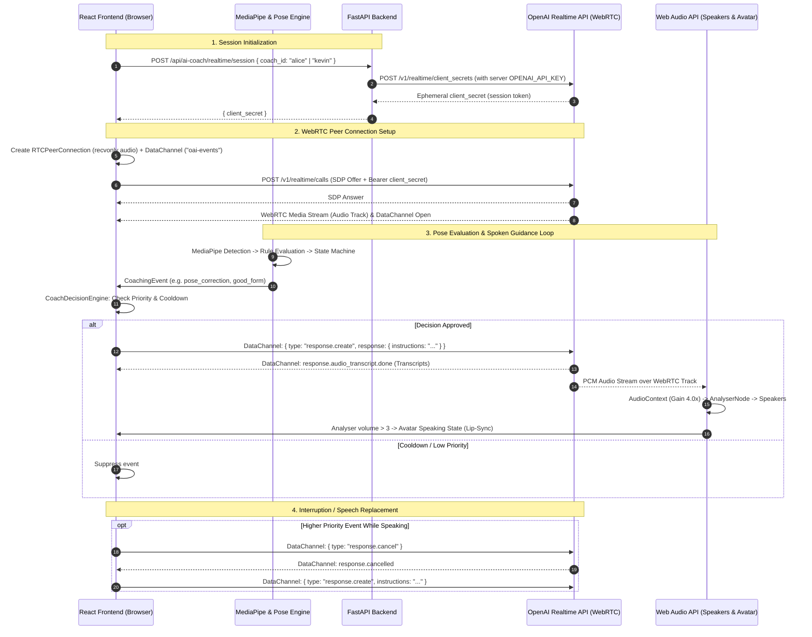

# VOICE ARCHITECTURE AUDIT

**Repository:** [ai-yoga-coach](https://github.com/arijit477/ai-yoga-coach)  
**Audit Date:** 2026-09-30  
**Phase:** Phase 1 — Voice Architecture Inspection & Audit  

---

## 1. Current Architecture

The AI Yoga Coach application currently employs a **client-side WebRTC direct connection** to OpenAI's Realtime API for real-time speech generation and avatar driving, backed by a FastAPI server for ephemeral session credential minting and legacy REST/TTS fallbacks.

### Architectural Overview
- **Session Initialization (Handshake):**
  1. The React client requests an ephemeral voice session token from FastAPI via `POST /api/ai-coach/realtime/session`.
  2. FastAPI securely calls OpenAI's Realtime REST endpoint `POST https://api.openai.com/v1/realtime/client_secrets` using the server-side `OPENAI_API_KEY`.
  3. OpenAI returns a scoped, temporary `client_secret` (ephemeral key), which FastAPI passes back to the browser.
- **Realtime Media Transport (WebRTC):**
  1. The browser initializes an `RTCPeerConnection` configured in **`recvonly`** audio mode.
  2. An RTCDataChannel (`oai-events`) is established for JSON event messaging.
  3. The client negotiates SDP directly with OpenAI Realtime GA (`https://api.openai.com/v1/realtime/calls`) using the ephemeral `client_secret`.
- **Audio Playback & Synchronization:**
  1. The incoming audio track from OpenAI is routed through the Web Audio API (`AudioContext` $\rightarrow$ `GainNode` [4.0x boost] $\rightarrow$ `AnalyserNode` [FFT 256 for lip-sync / speaking state] $\rightarrow$ `destination`).
  2. The hidden `<audio>` element is muted to prevent double-audio echo.
  3. A fallback to browser `window.speechSynthesis` is embedded in the voice agent in case WebRTC negotiation fails or disconnects.
- **Posture & Event Orchestration:**
  1. MediaPipe Tasks Vision runs entirely client-side via WebGL/GPU in `usePoseTracking.ts`.
  2. Landmarks are evaluated against asana rule sets in `usePoseEvaluation.ts`.
  3. Evaluated pose deltas and session state transitions feed into `CoachingEventEngine.ts` and `CoachingEventBuilder.ts`.
  4. Events are prioritized and throttled by `CoachDecisionEngine.ts` (cooldowns: 4s default, 10s repeat rule, 6s good form).
  5. Approved events trigger `speak()` on `RealtimeVoiceAgent.ts`, sending `response.create` instructions across the WebRTC DataChannel to OpenAI.

---

## 2. Voice Flow Diagram



---

## 3. Frontend Voice Files

| File Path | Role & Purpose | Key Functions / Classes |
| :--- | :--- | :--- |
| `frontend/src/features/ai-coach/voice/RealtimeVoiceAgent.ts` | **Primary Voice Agent:** Manages the WebRTC `RTCPeerConnection`, `RTCDataChannel` ("oai-events"), SDP exchange with OpenAI `/v1/realtime/calls`, `response.create` prompting, `response.cancel` interruption handling, Web Audio API `AudioContext` routing (`GainNode` + `AnalyserNode`), transcript emission, and `speechSynthesis` fallback. | `RealtimeVoiceAgent`, `connect()`, `speak()`, `triggerPoseStart()`, `sendCoachingEvent()`, `handleFunctionCall()`, `disconnect()`, `setupAudioAnalyzer()` |
| `frontend/src/features/ai-coach/voice/useRealtimeVoice.ts` | **React Hook:** Encapsulates `RealtimeVoiceAgent` and `CoachDecisionEngine` singletons across re-renders; provides reactive React state (`VoiceState`: status, transcripts, mute), handles start/stop lifecycle, and exposes dispatch functions. | `useRealtimeVoice()`, `start()`, `stop()`, `toggleMute()`, `dispatchEvent()`, `triggerPoseStart()` |
| `frontend/src/features/ai-coach/voice/CoachDecisionEngine.ts` | **Heuristic Priority & Cooldown Arbiter:** Prevents voice chatter and spam. Implements priority hierarchy (1: Safety $\rightarrow$ 2-4: Camera $\rightarrow$ 6: Pose Correction $\rightarrow$ 7: Improving $\rightarrow$ 8: Completed $\rightarrow$ 9: Good Form), 4,000ms baseline cooldown, 10,000ms identical rule suppression, and 6,000ms good-form cooldown. | `CoachDecisionEngine`, `evaluate()`, `getEventPriority()`, `approve()`, `reject()`, `reset()` |
| `frontend/src/features/ai-coach/voice/CoachingEventEngine.ts` | **Pose-to-Event State Machine:** Monitors frame-by-frame pose evaluations, detects new issues, tracks 30% improvement deltas, resolves fixed issues, handles camera readiness transitions, and periodically triggers holding mindfulness cues. | `CoachingEventEngine`, `process()`, `getRecentEvents()`, `reset()` |
| `frontend/src/features/ai-coach/voice/CoachingEventBuilder.ts` | **Event Factory:** Formats structured `CoachingEvent` objects with humanistic yoga cues, severity levels, body regions, and contextual descriptions for Alice/Kevin. | `CoachingEventBuilder`, `buildPoseCorrectionEvent()`, `buildGoodFormEvent()`, `buildSafetyWarningEvent()`, etc. |
| `frontend/src/features/ai-coach/voice/NaturalCoachLanguage.ts` | **Linguistic Variations:** Curates coach-specific mindfulness phrases, breath cues, and score milestone messages (e.g. 75+, 90+). | `getMindfulnessReminder()`, `getMilestoneMessage()`, `shouldFireMilestone()` |
| `frontend/src/features/ai-coach/voice/voice.types.ts` | **Type Definitions:** Declares `CoachingEvent`, `CoachingEventType`, `VoiceConnectionState`, `VoiceTranscriptItem`, `VoiceState`, `CoachDecision`. | Types: `VoiceConnectionState`, `CoachingEvent`, `CoachDecision`, etc. |
| `frontend/src/features/ai-coach/voice/index.ts` | **Barrel Export:** Re-exports voice agents, hooks, and types for consumption by `AICoachPage.tsx`. | Module exports |
| `frontend/src/features/ai-coach/voice/CoachTTSAgent.ts` | **Legacy / Secondary HTTP TTS Agent:** Alternative audio-blob TTS player that calls backend `/api/ai-coach/tts`. Implements queuing and HTMLAudioElement playback. (Currently orphaned/inactive in `AICoachPage.tsx`). | `CoachTTSAgent`, `speak()`, `processQueue()`, `stopSpeaking()` |
| `frontend/src/features/ai-coach/voice/providers/VoiceProvider.ts` | **Interface Stub:** Abstract interface (`initialize`, `streamText`, `stop`, `dispose`) left from previous architectural designs. No concrete `ElevenLabsVoiceProvider` currently implements this. | `interface VoiceProvider` |
| `frontend/src/features/ai-coach/components/AICoachPage.tsx` | **Main UI & Orchestrator:** Integrates `usePoseTracking`, `usePoseEvaluation`, `useCoachSession`, and `useRealtimeVoice`. Syncs pose state, dispatches coaching events, and controls voice start/stop. | `AICoachPage` |
| `frontend/src/features/ai-coach/avatar/AvatarPlayer.tsx` | **Avatar Lip-Sync:** Subscribes to voice state (`"speaking"` vs `"idle"`), animating the avatar video only while the voice agent audio is actively playing. | `AvatarPlayer` |

---

## 4. Backend Voice Files

| File Path | Role & Purpose | Key Endpoints / Functions |
| :--- | :--- | :--- |
| `backend/app/main.py` | **FastAPI Server Entrypoint:** Configures CORS middleware (`allow_origins=["*"]`) and registers API routers including `realtime.router`, `tts.router`, `chat.router`, `video_stream.router`. | FastAPI app initialization and route registration |
| `backend/app/api/routes/realtime.py` | **OpenAI Realtime Session Provider:** Exposes `POST /api/ai-coach/realtime/session`. Calls OpenAI `POST https://api.openai.com/v1/realtime/client_secrets` with backend `OPENAI_API_KEY`, injecting yoga coach instructions (`YOGAVERSE_SYSTEM_PROMPT` + `build_coach_instructions`), voice model (`gpt-realtime-2.1-mini`), and voice selection (`sage`/`ash`). | `create_realtime_session()`, `build_coach_instructions()`, `YOGAVERSE_SYSTEM_PROMPT` |
| `backend/app/api/routes/tts.py` | **Fallback & Legacy TTS Endpoint:** Exposes `POST /api/ai-coach/tts` and `GET /api/ai-coach/tts` (Streaming). Attempts synthesis using ElevenLabs REST/Streaming API (`eleven_flash_v2_5`), with automatic fallback to OpenAI `tts-1` (`/v1/audio/speech`). | `generate_tts()`, `generate_tts_get()`, `get_elevenlabs_config()`, `get_openai_config()` |
| `backend/app/services/ai_service.py` | **Legacy Chat Service:** Standalone LLM chat completion helper using `gpt-4o-mini` with strict non-vision constraints (`"You CANNOT see the user..."`). Used for text Q&A and session summaries. | `generate_coach_response()`, `COACH_PROFILES` |
| `backend/app/api/routes/chat.py` | **Text Chat & Summary Routes:** Exposes `POST /api/chat` and `POST /api/chat/summary` for textual yoga advice and post-session scorecard summaries. | `chat_endpoint()`, `chat_summary_endpoint()` |
| `backend/app/api/routes/video_stream.py` | **WebSocket Video Pipeline:** WebSocket endpoint `/api/ai-coach/video/stream` for server-side OpenCV/MediaPipe frame processing (alternative/experimental pipeline). | `video_stream()` |

---

## 5. OpenAI Configuration

### Configuration Details

| Parameter | Value / Location | Notes |
| :--- | :--- | :--- |
| **Realtime Model** | `gpt-realtime-2.1-mini` (or env `OPENAI_REALTIME_MODEL`) in `backend/app/api/routes/realtime.py` | Realtime mini GA model for voice and instructions |
| **Chat Fallback Model** | `gpt-4o-mini` in `backend/app/services/ai_service.py` | Used for non-realtime text chat and session summaries |
| **TTS Fallback Model** | `tts-1` in `backend/app/api/routes/tts.py` | Used only in fallback REST TTS endpoint |
| **Voices Configured** | **Alice:** `sage` (Realtime) / `nova` (OpenAI TTS) / `UPeqT2SXIhFkIpqF9UQW` (ElevenLabs)<br>**Kevin:** `ash` (Realtime) / `onyx` (OpenAI TTS) / `JBFqnCBsd6RMkjVDRZzb` (ElevenLabs) | Defined in `backend/app/api/routes/realtime.py` & `backend/app/api/routes/tts.py` |
| **Modality & Transceiver** | WebRTC Audio `direction: "recvonly"` + DataChannel `"oai-events"` | Initialized in `RealtimeVoiceAgent.ts` |
| **System Instructions** | Defined in `backend/app/api/routes/realtime.py` (`YOGAVERSE_SYSTEM_PROMPT` + `build_coach_instructions`) | Prompts coach to act as serene, unhurried personal yoga instructor, kinesthetic cues, under 12 words, silence during good form, respecting computer vision events |
| **Dynamic Spoken Prompts** | `RealtimeVoiceAgent.ts` (`sendResponseCreate`) wraps text in prosody instructions: *"Speak this yoga guidance with a peaceful, warm, graceful tone and unhurried natural pauses: \<text\>"* | Sent via DataChannel `response.create` |

> [!NOTE]
> All OpenAI API keys (`OPENAI_API_KEY`) and ElevenLabs API keys (`ELEVENLABS_API_KEY`) reside strictly within server-side environment files (`backend/.env`). No API secrets are exposed to client-side bundles or `frontend/.env`.

---

## 6. Audio Pipeline

The end-to-end audio pipeline operates as follows:

```
[User Microphone] ──(Disabled: recvonly)──x [OpenAI Audio Input]

[Pose Engine / Event Engine]
           │
           ▼
[RealtimeVoiceAgent (Frontend)]
           │
           │ (WebRTC DataChannel: response.create)
           ▼
[OpenAI Realtime API (Server)]
           │
           │ (WebRTC Remote Audio Stream - 24kHz Opus/PCM)
           ▼
[RTCPeerConnection ontrack]
           │
           ├──► [remoteAudioStream]
           │           │
           │           ▼
           │     [AudioContext]
           │           │
           │           ▼
           │     [GainNode (gain = 4.0)] ──► [Speakers (audioCtx.destination)]
           │           │
           │           ▼
           │     [AnalyserNode (fftSize = 256)]
           │           │
           │           ▼
           │     [Volume RMS Poller (>3)] ──► [Avatar Speaking State / Lip-sync]
           │
           └──► [<audio autoplay muted>] (Muted to prevent dual-playback echo)
```

1. **Microphone Input:**
   - In `RealtimeVoiceAgent.ts:98`, `this.stream = null` and `this.pc.addTransceiver("audio", { direction: "recvonly" })` is set.
   - Microphone capture is **disabled** to avoid background noise and VAD latency.
   - `startListening()` and `stopListening()` are empty no-ops.
2. **OpenAI Generation:**
   - Spoken responses are triggered programmatically via DataChannel `response.create` messages.
   - OpenAI synthesizes audio using the chosen voice (`sage` or `ash`) and streams RTP audio packets over the WebRTC peer connection.
3. **Audio Playback & Analysis:**
   - Received WebRTC media track is attached to a Web Audio API `AudioContext`.
   - Audio flows through a `GainNode` set to `4.0` (boosting output volume) to `audioCtx.destination`.
   - In parallel, an `AnalyserNode` computes real-time frequency data (`getByteFrequencyData`) every 50ms.
   - If average volume exceeds 3.0, `isSpeaking` flips to `true`, updating UI badges and activating `AvatarPlayer.tsx` video animation.
4. **Fallback:**
   - If WebRTC connection fails or drops, `speakWithBrowserTTS()` uses `window.speechSynthesis` as a backup.

---

## 7. Pose $\rightarrow$ Voice Pipeline

The pipeline connecting computer vision to speech execution is strictly decoupled across multiple layers:

```
┌────────────────────────────────────────────────────────┐
│ 1. MediaPipe Tasks Vision (usePoseTracking.ts)         │
│    Detects 33 3D body landmarks at 30+ FPS             │
└──────────────────────────┬─────────────────────────────┘
                           │ Landmarks
                           ▼
┌────────────────────────────────────────────────────────┐
│ 2. Pose Rule Evaluator (usePoseEvaluation.ts)          │
│    Calculates joint angles, checks target bounds,      │
│    and produces PoseEvaluationResult (score, issues)   │
└──────────────────────────┬─────────────────────────────┘
                           │ PoseEvaluationResult
                           ▼
┌────────────────────────────────────────────────────────┐
│ 3. Coaching Event Engine (CoachingEventEngine.ts)      │
│    - Detects state transitions (camera, session)       │
│    - Detects new primary issues                        │
│    - Checks 30% improvement threshold                  │
│    - Detects issue resolution & good form              │
│    - Enforces milestone & mindfulness intervals        │
└──────────────────────────┬─────────────────────────────┘
                           │ CoachingEvent[]
                           ▼
┌────────────────────────────────────────────────────────┐
│ 4. Coach Decision Engine (CoachDecisionEngine.ts)      │
│    - Safety priority check (Priority 1)                │
│    - Camera state check (Priority 2-4)                 │
│    - Identical rule cooldown (10,000ms)                │
│    - Global event cooldown (4,000ms)                   │
│    - Good-form cooldown (6,000ms)                      │
│    - Lifecycle event deduplication                     │
└──────────────────────────┬─────────────────────────────┘
                           │ Approved CoachingEvent
                           ▼
┌────────────────────────────────────────────────────────┐
│ 5. Realtime Voice Agent (RealtimeVoiceAgent.ts)        │
│    - Checks if active server response is in flight     │
│    - Cancels current response if needed                │
│    - Dispatches response.create via WebRTC DataChannel │
└────────────────────────────────────────────────────────┘
```

---

## 8. Security Analysis

| Check Item | Status | Finding |
| :--- | :---: | :--- |
| **OpenAI API Key Leakage** | **PASS** | `OPENAI_API_KEY` is referenced solely on the server in `backend/app/api/routes/realtime.py` and `backend/app/services/ai_service.py`. It is never bundled into the client Vite application or exposed in network responses. |
| **Ephemeral Token Scoping** | **PASS** | The frontend only receives a short-lived `client_secret` issued by OpenAI's `/v1/realtime/client_secrets` endpoint. This token expires quickly and cannot be used for unrestricted OpenAI API actions. |
| **ElevenLabs API Key** | **PASS** | `ELEVENLABS_API_KEY` is maintained strictly on the backend in `backend/app/api/routes/tts.py`. |
| **CORS Configuration** | **WARN** | `backend/app/main.py` uses `allow_origins=["*"]`. While acceptable for local development, production deployment must restrict this to authorized frontend origins. |
| **Session Rate Limiting / Auth** | **WARN** | `POST /api/ai-coach/realtime/session` is unauthenticated. Anyone with network access to the backend can request ephemeral OpenAI Realtime tokens. |

---

## 9. Problems With Current Architecture

1. **Inactive Microphone / No True Conversational Barging-In:**
   - `RealtimeVoiceAgent.ts` configures WebRTC as `recvonly`. User speech input and OpenAI Voice Activity Detection (VAD) are completely inactive. The coach cannot hear the user asking questions during practice.
2. **Duplicated / Fragmented Voice Implementations:**
   - `RealtimeVoiceAgent.ts` (WebRTC), `CoachTTSAgent.ts` (HTTP audio blob), `VoiceProvider.ts` (unused interface stub), and `backend/app/api/routes/tts.py` (REST/streaming ElevenLabs + OpenAI TTS) represent 3-4 competing paradigms.
3. **Discrepancy Between Docs and Implementation:**
   - Previous documentation (`ElevenLabsVoice.md`, `VOICE_ARCHITECTURE.md`) referenced an ElevenLabs WebSocket streaming proxy architecture, whereas the active code in `RealtimeVoiceAgent.ts` connects directly to OpenAI Realtime WebRTC using OpenAI native voices (`sage`/`ash`).
4. **Browser SpeechSynthesis Fallback in Production Path:**
   - If WebRTC drops or fails, `RealtimeVoiceAgent.ts` falls back to `window.speechSynthesis`, which produces inconsistent, robotic system voices across Safari and Chrome.
5. **Session Endpoint Lacks Authentication & Token Lifecycle Management:**
   - The backend `/session` endpoint has no rate-limiting or user validation, creating a vector for OpenAI credit exhaustion.
   - Long practice sessions (>15-30 minutes) risk token expiry or WebRTC connection drops without automated reconnection.
6. **Double-Audio & Gain Complexity in Web Audio API:**
   - Because the audio stream is attached to both an `<audio>` tag and an `AudioContext`, the `<audio>` tag must be kept permanently muted. If browser autoplay policies block the `AudioContext`, the coach becomes silent without a clear recovery banner.
7. **Race Conditions in Response Cancellation:**
   - Rapidly cancelling and queuing responses (`response.cancel` $\rightarrow$ `response_cancel_not_active` error) relies on event-driven error interception rather than an atomic state queue.

---

## 10. Recommended Migration

To establish a clean, production-grade, modular voice architecture, migrate to the target model below:

```
React Frontend
├── MediaPipe Vision (usePoseTracking)
├── Pose Engine (usePoseEvaluation & Asana Rules)
├── Feedback Controller (CoachingEventEngine + CoachDecisionEngine)
└── OpenAI Realtime Client (Single authoritative WebRTC Voice Client)

FastAPI Backend
└── Secure Session Initialization (Authenticated POST /api/ai-coach/realtime/session)
```

### Key Migration Steps:
1. **Consolidate Voice Engine on OpenAI Realtime WebRTC:**
   - Maintain the direct WebRTC peer connection for low-latency, natural audio delivery.
   - Enable bidirectional audio (microphone track + server VAD) when conversation mode is enabled, while keeping `recvonly` for pure pose-coaching mode.
2. **Retire Dead / Duplicate Implementations:**
   - Remove orphaned `CoachTTSAgent.ts`.
   - Remove unused `VoiceProvider.ts` stub or unify it to wrap the active `RealtimeVoiceAgent`.
   - Clean up or deprecate `/api/ai-coach/tts` if ElevenLabs is not actively utilized.
3. **Eliminate Browser `speechSynthesis`:**
   - Replace `window.speechSynthesis` with a graceful UI error / retry state.
4. **Harden FastAPI Session Security:**
   - Implement rate limiting and authentication middleware on `/api/ai-coach/realtime/session`.
   - Configure session parameters (model, voice, modal capabilities) centrally via environment variables.
5. **Robust Audio Context Autoplay Handling:**
   - Provide an explicit "Unlock Audio" user gesture handler to guarantee `AudioContext` activation across Safari, iOS, and Chrome.

---

## 11. Migration Risks

| Risk | Impact | Mitigation Strategy |
| :--- | :--- | :--- |
| **Browser Autoplay & AudioContext Lock** | High | Safari and Chrome block unprompted audio. Ensure the session start button explicitly resumes the `AudioContext` on user interaction. |
| **WebRTC ICE / SDP Negotiation Failure** | High | Implement comprehensive ICE connection state listeners (`oniceconnectionstatechange`) with exponential backoff retry and user-facing status indicators. |
| **Microphone Permission Denials** | Medium | If bidirectional voice is enabled, isolate mic permissions so that camera/pose tracking continues uninterrupted even if mic access is denied. |
| **OpenAI Realtime API Token Expiry** | Medium | Realtime sessions have maximum duration limits. Implement a silent token renewal and peer connection renegotiation before timeout. |
| **Event Race Conditions during Speech Cancellation** | Low | Replace ad-hoc `isCancelling` flags with an atomic, serialized asynchronous event queue. |

---

*Audit completed in accordance with Phase 1 specification. No application code was modified.*
